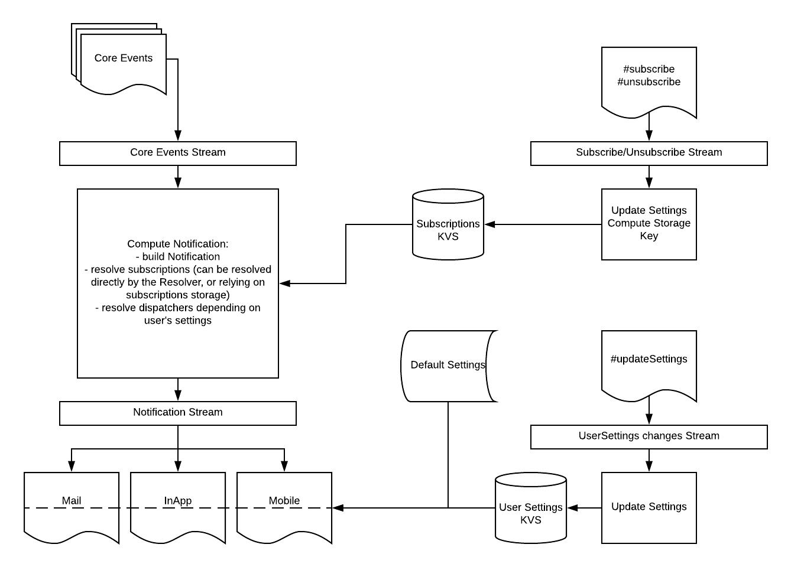

# Nuxeo Notifcation Stream

The Nuxeo Notification Stream module defines a new notification infrastructure using Nuxeo Stream and enabling the configuration of different channels to dispatch the notifications.

## Infrastructure Based on Nuxeo Stream

The target infrastructure is built on a topology of computations:
 - A first computation will read the core events in a stream. It will transform the core events into Notification, resolve the corresponding Notification event and target users. The notification object is pushed to a notification stream.
 - The Stream is consumed by all the notifiers contributed, and processes the event in case it has too. It fetches the settings of the user for the notification in order to determine if the dispatcher should process the notification or not.



### Notification Subscribers

Each entry in this KVS allows the system to determine the list of users to notify for a given notification.

Each Notification resolver exposes a way to compute a unique key for the KVS in order to store the corresponding user’s subscription. By default, the storage key is the Resolver className.
We can also consider to have some Notification Resolver that do not rely on a “subscriptions” mecanism like “task assigned”.

The KVS is updated via a subscription Stream. Every time a user subscribe/unsubscribe to a resolver, a new record is added to the Stream and a computation will update the proper entry or entries with the updated list of users.

Example of storage keys:
- `<documentUID>:<eventName>` => For the subscriptions to a specific document
- `<documentType>:<eventName>` => For the subscriptions to a generic rule like “I want to be notified whenever a document File is modified”
- `<className>` => default subscription storage key

### User Settings

A second KVS is used to store the user preferences regarding the notifications. A user can subscribe to `n` resolver and for each of them, decides which dispatcher are used to notify the user.

There is one entry per user in the application and for each entry, the value is an object containing all the notification channels the user decides to subscribe to per resolver.

When resolving a user settings, default dispatcher configuration is appended, or fill no-configured ones.


## Resolving the List of Users to Notify

Each resolver is responsible to define the list of users to notify.

An abstraction is defined for resolver a user subscribes to like being notified whenever an event occurs on a Document, it is the `SubscribableResolver` and it exposes methods to subscribe, unsuscribe or fetch the list of subscribers of a resolver. The subscriptions are stored in a KeyValue store. For applications with a huge number of documents, the size of the entries in the KVS listing the subscribers for an event and a document will grow dramatically and we have to make sure the infrastructure can still scale.

## Extensions

### Contributing to New Notifier

When contributing a new dispatcher, the following information must be provided:
 - The class of the notifier. The implementation defines how to dispatch the notif after getting it from the Stream
 - The name of the Stream where the notifications are consumed
 - A list of FreeMarker templates to render the message based on the notification type, including a default one if there is no template found for a given notification type.
The extension point supports merge in order to easily allow the contribution of new notification type without having to overwrite the existing contributions.

Example:
```$xslt
<notifier id="inapp" class="org.nuxeo.ecm.platform.notification.dispatcher.DummyDispatcher">
  <property name="myProp">myValue</property>
</notifier>
```

### Contributing to New Notification Type (aka a Resolver)

When contributing a new notification type, the following information must be provided:
 - An id for the resolver
 - A class of the notification type. The implementation provides methods for:
    - Defining if an event is accepted or not
    - Fetching the list of target users for the notification
    - Defining the context information for the notification

```$xslt
<resolver id="notifsDoc" class="com.nuxeo.brand.management.notification.type.impl.NotifsDocsResolver">
</resolver>
```

### Contributing Resolver Default Settings

It is possible to define the default settings for each resolver. For a given resolver, it possible to enable or disable notifier, and define if the notifier is active by default.
When no default settings are defined, the notifiers are enabled and not active.

```$xslt
<settings id="resolverId">
  <notifier name="notifierId1" default="true" enable="true" />
  <notifier name="notifierId2" default="false" enable="true" />
</settings>
<settings id="resolverId2">
  <notifier name="notifierId1" enable="false" />
  <notifier name="notifierId2" enable="false" />
</settings>
```

## Building

To build, simply start the Maven build:

    mvn clean install

## About Nuxeo

Nuxeo dramatically improves how content-based applications are built, managed and deployed, making customers more agile, innovative and successful. Nuxeo provides a next generation, enterprise ready platform for building traditional and cutting-edge content oriented applications. Combining a powerful application development environment with SaaS-based tools and a modular architecture, the Nuxeo Platform and Products provide clear business value to some of the most recognizable brands including Verizon, Electronic Arts, Sharp, FICO, the U.S. Navy, and Boeing. Nuxeo is headquartered in New York and Paris. More information is available at www.nuxeo.com.
